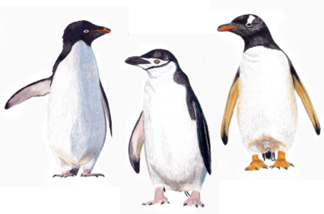
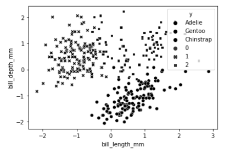
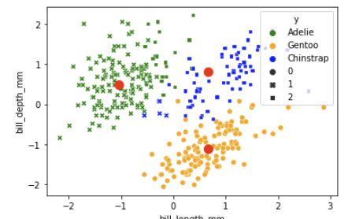
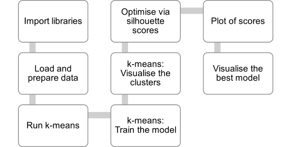

# Clustering

## Learning Objectives
---
- Understand the concept of clustering.
- Learn about the k-means clustering algorithm and how it works.
- Know how to choose the right number of clusters using techniques like the elbow method or silhouette analysis.
- Apply k-means clustering on a dataset.

## Introduction
---
Clustering is a technique in unsupervised machine learning that involves grouping similar data points together based on their attributes or features. 

The goal of clustering is to partition a dataset into clusters or groups such that data points within each cluster are more similar to each other than to those in other clusters. This can help reveal patterns, structures, and relationships in the data that may not be apparent at first glance and can provide insights into the underlying processes that generated the data.

Clustering is important in data analytics because it can help identify segments of data that exhibit similar behaviours, preferences, or characteristics. This, in turn, can be used to make predictions or inform decision-making. For example, clustering can be used to segment customers based on their purchasing patterns or to identify groups of genes that are co-expressed in biological data. 

**Example**

The Penguin dataset is a collection of physical measurements of three species of penguins - Adelie, Gentoo, and Chinstrap. 

The measurements include features such as bill length, flipper length, body mass, and sex. This dataset is often used in clustering analysis as it provides a useful example of how clustering algorithms can group similar data points based on their physical characteristics. The goal of clustering on this dataset is to group penguins into distinct clusters based on their physical measurements and species, which can provide insights into the natural classification of penguins and help in understanding the patterns of their physical attributes.

## k-means clustering
---
K-means is a popular clustering algorithm used in machine learning and data analysis to group similar data points together.

In k-means clustering, we start by choosing a value for **k**, which represents the **number of clusters** we want to form.

 Then, the algorithm *randomly* selects k data points from the dataset to act as the initial **centroids** of the clusters.

 

Next, the algorithm assigns each data point in the dataset to the nearest centroid based on the distance between the data point and the centroid. This forms the initial clusters.

Then, the algorithm calculates the mean of the data points in each cluster and moves the centroid to that mean. The algorithm then re-assigns each data point to the nearest centroid based on the new centroid positions. This process is repeated until the centroids no longer move significantly or until a maximum number of iterations is reached.

At the end of the algorithm, the data points are grouped into k clusters based on their similarity to each other, and each cluster is represented by a centroid.

## Choosing the right number of clusters
In the Penguin dataset, we have different physical measurements for three different species of penguins - Adelie, Gentoo, and Chinstrap. The goal of k-means clustering is to group the penguins into clusters based on their physical measurements.

One of the difficulties in choosing the optimal value of k in k-means clustering is that it can be hard to determine how many clusters there should be. If we choose too few clusters, the clusters might be too general and not tell us much about the differences between the penguins. If we choose too many clusters, the clusters might be too specific and not tell us much about the similarities between the penguins.

For example, if we choose k = 2, we might end up with one cluster for Adelie penguins and another cluster for Gentoo and Chinstrap penguins combined. This would be too general because it doesn't tell us much about the differences between Gentoo and Chinstrap penguins.

On the other hand, if we choose k = 5, we might end up with one cluster for each species of penguin and two additional clusters for Adelie and Gentoo penguins that have different physical characteristics. This would be too specific because it doesn't tell us much about the similarities between different types of penguins.

To determine the optimal value of k in k-means clustering, we can use techniques like the **elbow method** or **silhouette analysis**, which help us to determine the number of clusters that provides the best balance between accuracy and interpretability.

A **silhouette score of 0.5 or higher** indicates that the clustering configuration is reasonable, while a score below 0.5 suggests that there might be overlapping clusters. So in our case, the right cluster choice is 2 or 3.

**Steps**

## Exercise
In this exercise we will run a KMeans model to classify the different species of Penguin found in the `penguins.csv` dataset based on some of their features.
- The dataset can be found here: [penguins.csv](../datasets/penguins.csv)
- The exercise Jupyter notebook can be found here: [09_kmeans.ipynb](../notebooks/09_kmeans.ipynb)

## Challenge
In this challenge you are tasked with using a K-Means clustering model to classify and group together the different species of Iris found in the `iris.csv` dataset. This is a very well known dataset and is used in many examples of classification and machine learning; don't be afraid to look back at your previous exercise and own research if you get stuck.
- The dataset can be found here: data set [iris.csv](../datasets/iris.csv)
- You can create your own Jupyter notebook for this challenge.

Use [this form](https://airtable.com/shrvo9ePjlwnaiLv5?prefill_Item=data_eng_stats05) to submit your code and screen recording

## Moving on

That is a wrap for an Introduction to Data Analysis. You will no doubt want to return to this module for refreshers on the various models and tools we implemented throughout. Keep your Jupyter notebooks handy for reference as we journey onward to the Netflix project and then SQL for Data Analysis.

Next: - [How should Netflix spend 5 billion dollars?](../../projects/netflix.md)

<!-- BEGIN GENERATED SECTION DO NOT EDIT -->

---

**How was this resource?**  
[😫](https://airtable.com/shrUJ3t7KLMqVRFKR?prefill_Repository=makersacademy%2Fintro-to-data-analysis&prefill_File=stats_bites02%2Fbites%2F09_clustering.md&prefill_Sentiment=😫) [😕](https://airtable.com/shrUJ3t7KLMqVRFKR?prefill_Repository=makersacademy%2Fintro-to-data-analysis&prefill_File=stats_bites02%2Fbites%2F09_clustering.md&prefill_Sentiment=😕) [😐](https://airtable.com/shrUJ3t7KLMqVRFKR?prefill_Repository=makersacademy%2Fintro-to-data-analysis&prefill_File=stats_bites02%2Fbites%2F09_clustering.md&prefill_Sentiment=😐) [🙂](https://airtable.com/shrUJ3t7KLMqVRFKR?prefill_Repository=makersacademy%2Fintro-to-data-analysis&prefill_File=stats_bites02%2Fbites%2F09_clustering.md&prefill_Sentiment=🙂) [😀](https://airtable.com/shrUJ3t7KLMqVRFKR?prefill_Repository=makersacademy%2Fintro-to-data-analysis&prefill_File=stats_bites02%2Fbites%2F09_clustering.md&prefill_Sentiment=😀)  
Click an emoji to tell us.

<!-- END GENERATED SECTION DO NOT EDIT -->
